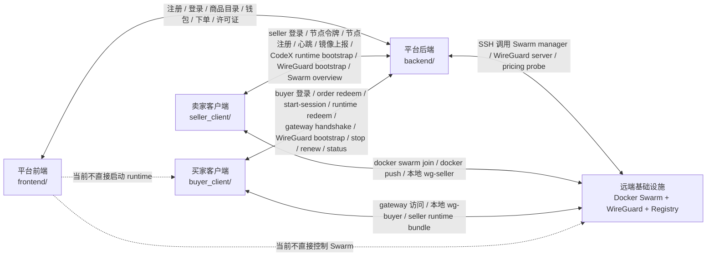
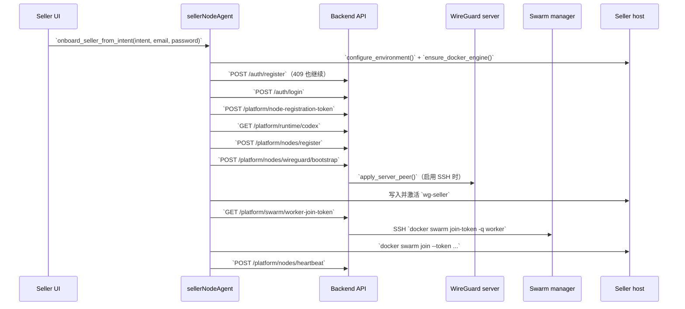
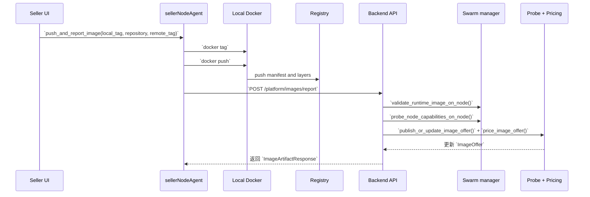
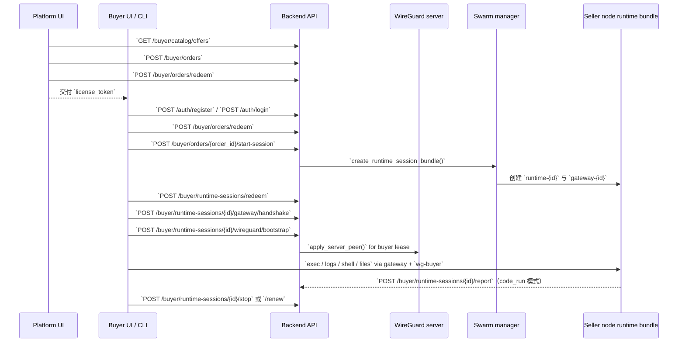
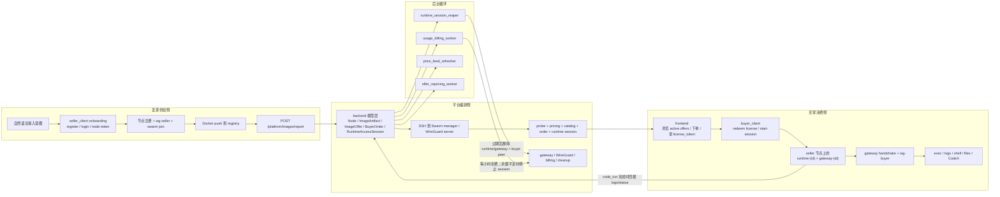

# Pivot Backend Build Team

这是一个面向“容器使用权 / 算力使用权交易”的多模块仓库。当前项目不是“一个后端 + 两个页面”，而是一个由平台后端、本地卖家客户端、本地买家客户端、平台前端、远端 Docker Swarm / WireGuard 基础设施共同组成的闭环系统。

这份 README 重点回答四件事：

- 代码里现在到底有哪些模块
- 模块之间的真实调用边界是什么
- 卖家供给和买家消费是如何闭环的
- 当前已经跑通什么、还卡在什么地方

## 一句话看懂当前系统

- 卖家侧通过 `seller_client/` 把一台本地机器注册成平台节点，拉起 `wg-seller`，加入远端 Swarm，并把镜像推送到平台 registry。
- 平台侧通过 `backend/` 负责认证、节点、镜像、商品、订单、许可证、运行时会话、WireGuard peer、计费与过期回收。
- 买家先在 `frontend/` 下单并获得 `license_token`，再由 `buyer_client/` 真正启动 runtime session、握手 gateway、拉起 `wg-buyer`，执行 `exec / logs / shell / files / CodeX`。
- 远端 Swarm manager 和 WireGuard server 不是前端或 buyer 直接控制的，而是由 `backend/` 通过 SSH 间接编排，或由卖家本机通过 join token 直接接入。
- 后端启动后会后台跑 `runtime_session_reaper`、`usage_billing_worker`、`price_feed_refresher`、`offer_repricing_worker` 四个循环。

## 五大模块协作图



补充说明：

- `frontend/` 只负责交易入口，不直接创建 runtime session。
- `buyer_client/` 才是真正消费卖家运行时的客户端。
- `backend/` 既不是 seller 机器本身，也不是 Swarm manager 本身；它是业务编排层。
- `Docker_swarm/` 目录保存的是远端调度资产、脚本和部署方式；真正的执行面在远端 manager / worker 上。

## 代码里的真实模块边界

| 模块 | 关键文件 / 路由 | 当前职责 |
| --- | --- | --- |
| `frontend/` | `frontend/app.js`，后端挂载 `/platform-ui` | 注册、登录、钱包、商品目录、下单、查看订单和许可证 |
| `backend/` | `backend/app/api/routes/auth.py`、`platform.py`、`platform_offers.py`、`buyer_catalog.py`、`buyer_orders.py`、`buyer.py` | 统一 HTTP API，负责 seller/buyer 认证、节点、镜像、商品、订单、许可证、runtime session、WireGuard、计费 |
| `seller_client/` | `seller_client/agent_server.py`、`seller_client/agent_mcp.py` | 卖家本地接入：安装、配置、登录、节点注册、`wg-seller`、Swarm worker join、镜像 push/report |
| `buyer_client/` | `buyer_client/agent_server.py`、`buyer_client/runtime/api.py`、`buyer_client/runtime/gateway.py`、`buyer_client/runtime/wireguard.py` | 买家本地消费：启动 session、gateway 握手、`wg-buyer`、exec / logs / shell / files、CodeX 编排 |
| `Docker_swarm/` | `Docker_swarm/README.md`、`scripts/`、远端 manager | manager 初始化、worker 接入、service 调度、registry / Portainer / benchmark 等控制面资产 |

## 当前系统的三条主线

### 1. 卖家供给闭环

真实代码链路分成两段：

- 接入段：卖家账户 -> 节点注册 -> `wg-seller` -> Swarm worker
- 供给段：本地镜像 -> registry -> `ImageArtifact` -> probe / pricing -> `ImageOffer`

卖家接入使用的关键后端接口：

- `POST /api/v1/auth/register`
- `POST /api/v1/auth/login`
- `POST /api/v1/platform/node-registration-token`
- `GET /api/v1/platform/runtime/codex`
- `POST /api/v1/platform/nodes/register`
- `POST /api/v1/platform/nodes/heartbeat`
- `POST /api/v1/platform/nodes/wireguard/bootstrap`
- `GET /api/v1/platform/swarm/worker-join-token`

卖家镜像上架使用的关键后端接口：

- `POST /api/v1/platform/images/report`
- `POST /api/v1/platform/image-offers`
- `POST /api/v1/platform/image-offers/{offer_id}/probe`

#### 卖家接入时序图



#### 卖家镜像发布时序图



这张图描述的是代码目标路径。需要强调的当前现状是：

- `backend/app/api/routes/platform.py` 在 `images/report` 成功后会立即调用 `run_offer_probe_and_pricing()`，尝试把镜像直接变成 buyer 可见商品。
- 但仓库内 `2026-04-02` 的 UI 闭环记录 [docs/completed/e2e/seller-to-buyer-ui-closed-loop-2026-04-02.md](docs/completed/e2e/seller-to-buyer-ui-closed-loop-2026-04-02.md) 显示，这条“push 后立刻 buyer 可见”的自动上架路径仍可能失败，导致 offer 停在 `probing` 而不是 `active`。

### 2. 买家消费闭环

当前买家消费也分成两段：

- 交易段：平台前端列商品、下单、签发 `license_token`
- 运行段：买家本地客户端拿许可证或直接创建 session，连接 runtime gateway 和 `wg-buyer`

平台前端侧实际使用的接口：

- `GET /api/v1/buyer/catalog/offers`
- `GET /api/v1/buyer/catalog/offers/{offer_id}`
- `GET /api/v1/buyer/wallet`
- `GET /api/v1/buyer/wallet/ledger`
- `POST /api/v1/buyer/orders`
- `GET /api/v1/buyer/orders`
- `POST /api/v1/buyer/orders/redeem`

买家本地客户端实际使用的接口：

- `POST /api/v1/auth/register`
- `POST /api/v1/auth/login`
- `POST /api/v1/buyer/orders/{order_id}/start-session`
- `POST /api/v1/buyer/runtime-sessions`
- `POST /api/v1/buyer/runtime-sessions/redeem`
- `POST /api/v1/buyer/runtime-sessions/{session_id}/gateway/handshake`
- `POST /api/v1/buyer/runtime-sessions/{session_id}/wireguard/bootstrap`
- `GET /api/v1/buyer/runtime-sessions/{session_id}`
- `POST /api/v1/buyer/runtime-sessions/{session_id}/stop`
- `POST /api/v1/buyer/runtime-sessions/{session_id}/renew`

#### 买家下单并进入卖家运行时时序图



这里最容易理解错的点有两个：

- 平台前端不会直接创建 runtime session，它只负责交易和许可证。
- 真正的“进入卖家容器并操作它”发生在 `buyer_client/`，不是 `frontend/`。

### 3. 计费与回收闭环

后端启动后会拉起四个后台线程：

- `runtime_session_reaper`：清理过期 session，移除 runtime / gateway service，并撤销 buyer peer
- `usage_billing_worker`：对绑定 `ImageOffer` 的 session 按小时扣费，余额不足会停止会话
- `price_feed_refresher`：刷新价格源
- `offer_repricing_worker`：重算已发布 offer 的时价

这意味着当前代码里已经有：

- `BuyerWallet`
- `WalletLedger`
- `UsageCharge`
- `RuntimeAccessSession.accrued_usage_cny`
- 过期回收与停止时的资源清理

但它仍然不是完整支付产品，当前更接近“闭环计费骨架”。

## 卖家-买家闭环总图



这张总图表达的是当前最接近“产品真相”的理解方式：

- 卖家负责供给节点和镜像
- 平台负责把供给变成商品、订单和会话
- 买家负责真正消费运行时
- 后端后台循环负责价格、计费和回收

## 当前产品真相

### 已经对上代码的事实

- `frontend/` 只做交易入口，不做 runtime 管理。
- `buyer_client/agent_server.py` 已经支持本地 Web 控制面，并且在 gateway 模式下支持 `exec`、`logs`、`shell`、`files`。
- `buyer_client/codex_orchestrator.py` 已经支持在本地工作区内启动 CodeX 作业，再通过 `buyerRuntimeAgent` MCP 操作远端 session。
- `backend/app/services/runtime_bootstrap.py` 会把 OpenAI key 保留在后端，再把 seller 需要的 CodeX runtime bootstrap 下发出去。
- `backend/app/services/swarm_manager.py` 通过 Paramiko SSH 到远端 manager，创建 `runtime-{id}` 和 `gateway-{id}` 两类 service。
- `backend/app/services/runtime_sessions.py` 和 `usage_billing.py` 已经处理过期回收、停止和小时级扣费。

### 当前仍然要明确写清的限制

- 当前平台前端不能直接“打开终端进入卖家容器”，必须借助 `buyer_client/`。
- 当前支付与充值还没有做成完整产品，wallet 更像测试余额与账本骨架。
- 当前自动上架链路虽然已经写进代码，但 `2026-04-02` 的 UI 实跑记录说明 `POST /api/v1/platform/images/report` 后半段仍可能失败，导致 seller 刚推的镜像没有立刻变成 buyer 可见的 active offer。
- 当前项目已经支持 buyer 通过 `wg-buyer -> wg0 -> seller` 的网络路径直连 seller 节点，但这仍属于受平台会话约束的租期访问，不是直接发放 seller 主机的长期 SSH 权限。

## 当前已验证的闭环

根据仓库里的代码、测试和已存档闭环文档，当前可以把项目状态概括为：

- 卖家接入闭环：已跑通
  - 卖家注册 / 登录
  - 节点注册与心跳
  - `wg-seller`
  - Docker Swarm worker join
- 买家运行闭环：已跑通
  - `inline_code`
  - `archive`
  - `GitHub repo`
  - `shell`
  - gateway `exec / logs / shell / files`
- 买家网络闭环：已跑通
  - buyer lease WireGuard bootstrap
  - `wg-buyer`
  - buyer 到 seller 的平台内网访问
- 订单 / 许可证 / runtime session 闭环：已跑通
  - `BuyerOrder`
  - `license_token`
  - `start-session`
  - `connect_code`
  - `session_token`
- 定价 / 计费 / 回收骨架：已写入代码并有后台线程支持

推荐直接阅读这些闭环文档：

- [docs/completed/client/seller-client-closed-loop.md](docs/completed/client/seller-client-closed-loop.md)
- [docs/completed/client/buyer-client-closed-loop.md](docs/completed/client/buyer-client-closed-loop.md)
- [docs/completed/platform-backend/platform-backend-closed-loop.md](docs/completed/platform-backend/platform-backend-closed-loop.md)
- [docs/completed/server/server-runtime-network-closed-loop.md](docs/completed/server/server-runtime-network-closed-loop.md)
- [docs/completed/e2e/seller-to-buyer-ui-closed-loop-2026-04-02.md](docs/completed/e2e/seller-to-buyer-ui-closed-loop-2026-04-02.md)

## 本地开发基础设施

根目录 `compose.yml` 当前会拉起这些服务：

- `db`：PostgreSQL
- `redis`：Redis
- `registry`：Docker registry
- `portainer`：Portainer
- `backend`：FastAPI 应用
- `worker`：Celery worker

它适合本地后端开发，但不等于完整远端生产拓扑。真正的 seller runtime 调度仍依赖远端 Swarm manager / worker。

## 常见入口

### 启动后端

在 `backend/` 下运行：

```powershell
uvicorn app.main:app --host 127.0.0.1 --port 8000
```

### 平台前端

后端启动后直接访问：

```text
http://127.0.0.1:8000/platform-ui
```

### 卖家本地网页

```powershell
python seller_client\agent_server.py
```

默认地址：

```text
http://127.0.0.1:3847
```

### 买家本地网页

```powershell
python buyer_client\agent_server.py
```

默认地址：

```text
http://127.0.0.1:3857
```

### Windows 一次性管理员安装

```powershell
powershell -ExecutionPolicy Bypass -File "environment_check\install_windows.ps1" -Apply
```

这条入口会统一准备：

- seller / buyer CodeX MCP 挂载
- Windows WireGuard elevated helper
- seller session gateway bridge
- seller gateway 防火墙规则
- 远端 `wg0` / Swarm 基础设施检查

## 推荐阅读顺序

如果是第一次接手这个仓库，建议按这个顺序看：

1. 先读这份 `README.md`，建立模块边界和闭环认识。
2. 再读 `docs/completed/` 下的 seller、buyer、backend、server 四份闭环文档。
3. 再读 `docs/completed/e2e/seller-to-buyer-ui-closed-loop-2026-04-02.md`，理解当前 UI 级闭环与已知缺口。
4. 再看 `backend/app/api/routes/` 和 `backend/app/services/`，理解后端编排边界。
5. 再看 `seller_client/` 和 `buyer_client/`，理解本地客户端是如何把平台能力落地到实际机器上的。

## 当前建议的人类理解方式

不要把这个项目理解成“一个网站 + 若干脚本”。

更准确的理解是：

- `frontend/` 是交易入口
- `seller_client/` 是供给接入器
- `buyer_client/` 是消费执行器
- `backend/` 是业务编排中枢
- `Docker_swarm/` 和远端基础设施是实际执行平面

只有把这五层一起看，README 里的时序图和闭环图才会和代码真正对得上。
