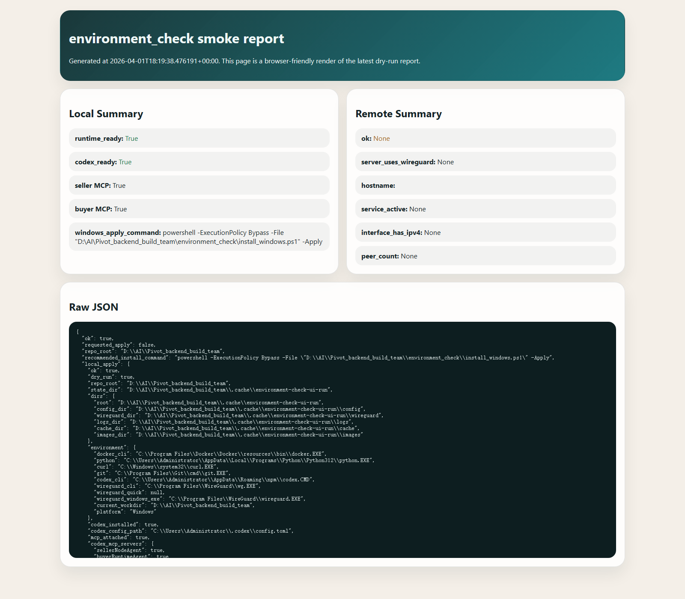
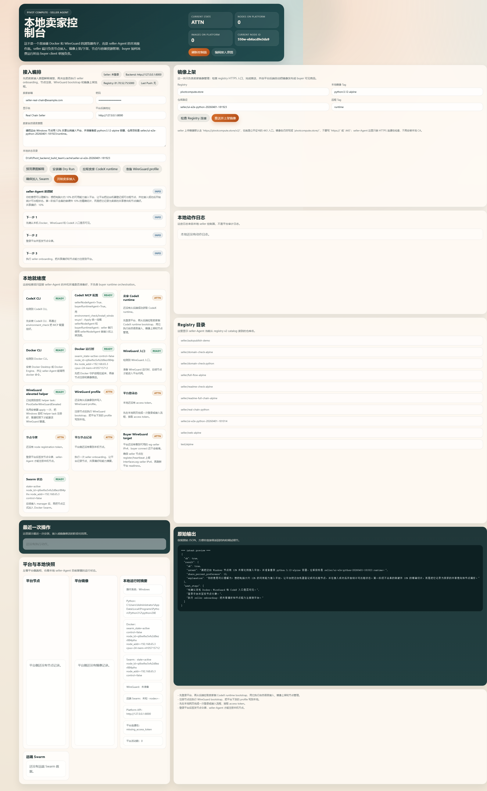
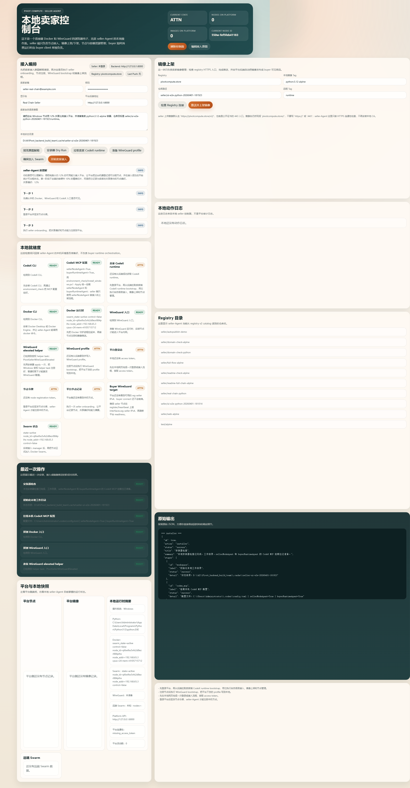
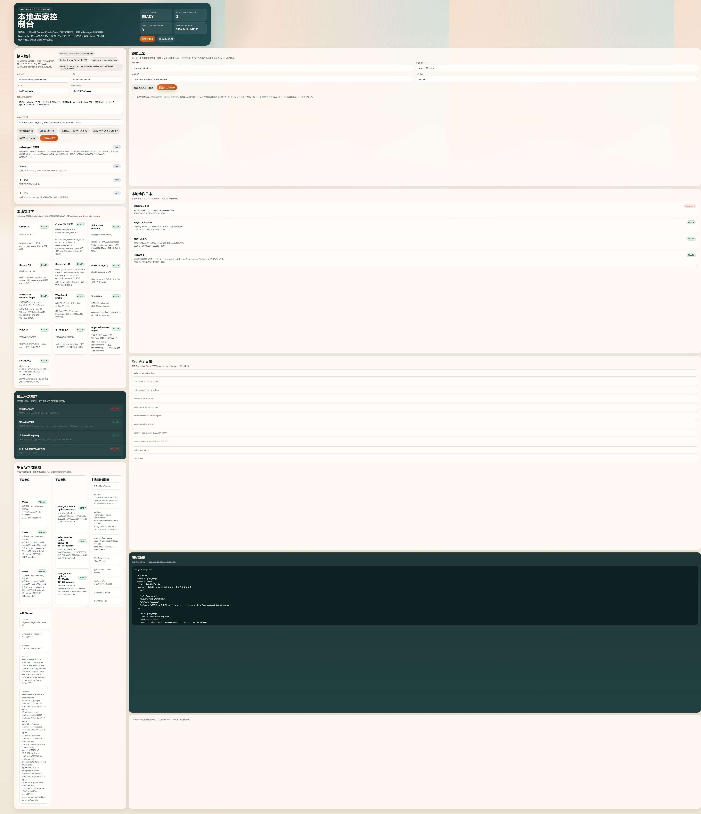
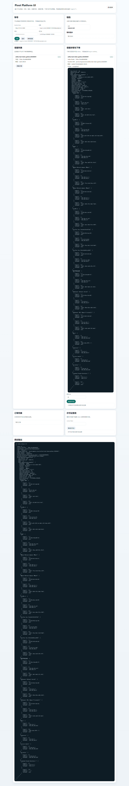
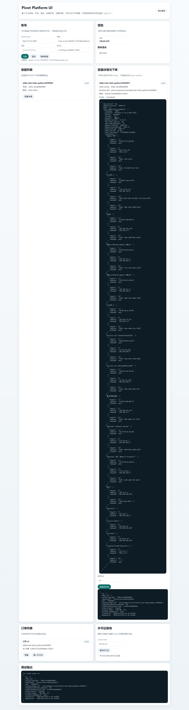
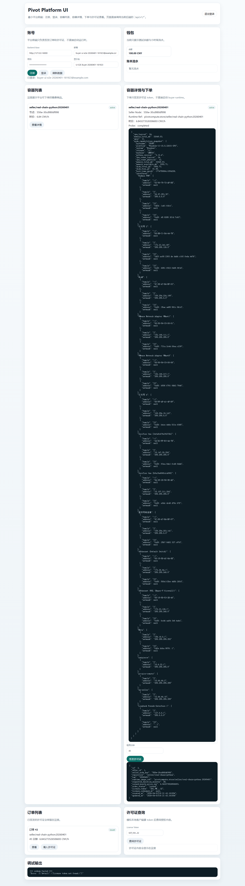
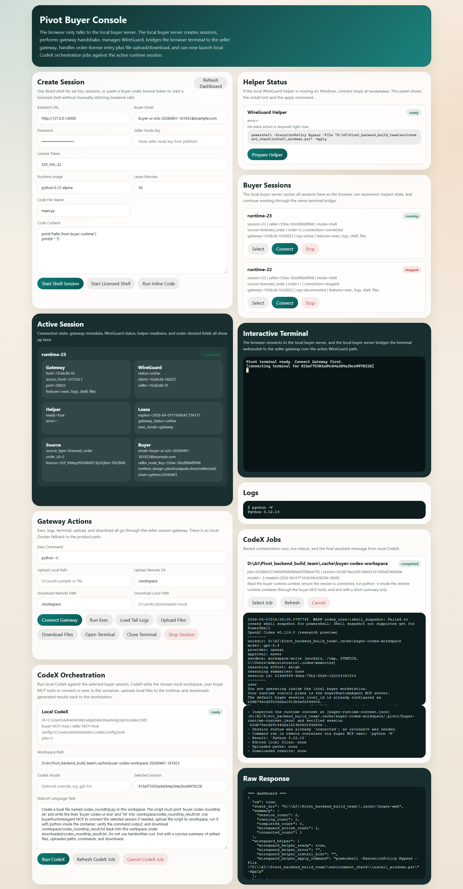
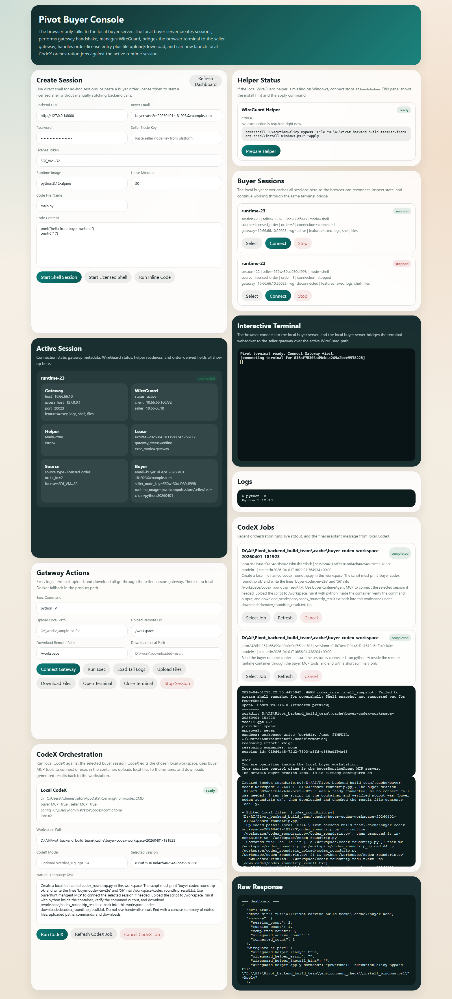

# Seller To Buyer UI Closed Loop 2026-04-02

## Scope

This document records a real end-to-end run completed on `2026-04-02` Beijing time.

- Seller UI: `http://127.0.0.1:3847/`
- Platform UI: `http://127.0.0.1:8000/platform-ui`
- Buyer UI: `http://127.0.0.1:3857/`
- Automation entry: `docs/tools/run_ui_full_closed_loop.py`
- Evidence folder: `docs/assets/ui-full-closed-loop-20260401-181923`
- Run time in local timezone: `2026-04-02 02:19:23` Asia/Shanghai

## Verdict

1. Seller and buyer both operated from UI: passed.
2. Seller natural-language onboarding: passed.
3. Seller natural-language full image listing: partial.
4. Buyer registered and logged in on the platform and obtained a license token: passed.
5. Buyer used the license in the local buyer client to open the seller container terminal: passed.
6. Buyer used natural-language CodeX to operate the container and move files between local workspace and container: passed.
7. `environment_check` installer and readiness flow: passed.

The main caveat is important:

- The newly pushed seller image reached the registry successfully.
- The platform auto-publish call `POST /api/v1/platform/images/report` returned `500 Internal Server Error`.
- The new offer row was still created, but it stayed at `offer_status=probing`, `probe_status=completed`, and `current_billable_price_cny_per_hour=null`.
- Because of that, the buyer side could not consume the freshly listed image in the same run.
- To finish the buyer half of the closed loop, this run used the already active fallback offer `seller/real-chain-python:20260401`.

So the current product truth is:

- Seller onboarding and registry push work from UI.
- Buyer consumption works from UI.
- The seller "push and immediate buyer-visible publish" link is still broken in the platform auto-publish path.

## Screenshots

### 1. environment_check dry run



### 2. Seller natural-language intent preview



### 3. Seller installer dry run



### 4. Seller onboarding success


### 5. Seller push image and auto-publish failure



### 6. Platform login and offers



### 7. Platform create order and obtain license



### 8. Platform redeem license



### 9. Buyer connected session and terminal



### 10. Buyer CodeX orchestration result



## What Actually Happened

### environment_check

The dry-run report came from `environment_check/windows_bootstrap.py:281`.

Observed result:

- `runtime_ready=true`
- `codex_ready=true`
- `seller_codex_mcp_attached=true`
- `buyer_codex_mcp_attached=true`
- `needs_windows_wireguard_helper=false`
- `needs_windows_gateway_bridge=false`
- `needs_windows_gateway_firewall=false`

Remote server verification also passed:

- host: `81.70.52.75`
- remote hostname: `VM-0-3-opencloudos`
- interface: `wg0`
- `wg-quick@wg0`: enabled and active
- `wg0` IPv4: `10.66.66.1/24`
- UDP listen port: `45182`
- Swarm manager host: `81.70.52.75`

### seller UI

Seller UI calls were made through `seller_client/agent_server.py:855`, `seller_client/agent_server.py:866`, `seller_client/agent_server.py:882`, `seller_client/agent_server.py:902`, `seller_client/agent_server.py:973`, and `seller_client/agent_server.py:992`.

This run used the following seller parameters:

- seller email: `seller-real-chain@example.com`
- local state dir: `D:\AI\Pivot_backend_build_team\.cache\seller-ui-e2e-20260401-181923`
- natural-language intent: connect the Windows node with `12%` share preference and prepare to sell `python:3.12-alpine`
- pushed runtime target: `pivotcompute.store/seller/ui-e2e-python-20260401-181923:runtime`

Observed seller results:

- Intent preview succeeded.
- Installer dry run succeeded.
- Seller onboarding succeeded.
- Registry connectivity check succeeded.
- Docker push succeeded.
- Platform image report failed with `500 Internal Server Error`.

Actual failed call:

- seller MCP function: `seller_client/agent_mcp.py:1020`
- backend route: `backend/app/api/routes/platform.py:277`
- backend publish flow: `backend/app/api/routes/platform.py:326`
- probe/pricing service: `backend/app/services/image_offer_publishing.py:44`
- pricing functions: `backend/app/services/pricing_engine.py:246` and `backend/app/services/pricing_engine.py:335`

Observed database result after the failed publish:

- new artifact existed
- new offer existed
- new offer repository: `seller/ui-e2e-python-20260401-181923`
- new offer tag: `runtime`
- `offer_status=probing`
- `probe_status=completed`
- `current_billable_price_cny_per_hour=null`
- `pricing_error=null`

This means the push-to-registry half worked, but the "platform turns it into a buyer-visible active offer" half did not complete.

### platform UI

Platform UI calls came from `frontend/app.js:164`, `frontend/app.js:177`, `frontend/app.js:225`, `frontend/app.js:257`, and `frontend/app.js:278`.

This run used a fresh buyer account:

- buyer email: `buyer-ui-e2e-20260401-181923@example.com`
- password: `super-secret-password`

Observed platform results:

- register succeeded
- login succeeded
- wallet and active offers loaded
- the freshly pushed seller offer was not visible in buyer catalog because it never became `active`
- the run therefore selected fallback active offer `seller/real-chain-python:20260401`
- order creation succeeded
- redeem succeeded

Observed platform purchase parameters:

- selected offer mode: `fallback_existing_active_offer`
- selected offer: `seller/real-chain-python:20260401`
- `offer_id=1`
- `seller_node_key=550w-30cd980df998`
- `runtime_image_ref=pivotcompute.store/seller/real-chain-python:20260401`
- `order_id=2`
- requested duration: `45` minutes
- issued hourly price: `6.843273526506693` CNY/h
- license token: masked in screenshots and summary

### buyer UI

Buyer UI calls came from `buyer_client/agent_server.py:1043`, `buyer_client/agent_server.py:1089`, `buyer_client/agent_server.py:1317`, `buyer_client/agent_server.py:1412`, `buyer_client/agent_server.py:1442`, `buyer_client/agent_server.py:1480`, `buyer_client/agent_server.py:1542`, and `buyer_client/agent_server.py:1577`.

Gateway transport helpers are in `buyer_client/runtime/gateway.py:109`, `buyer_client/runtime/gateway.py:134`, `buyer_client/runtime/gateway.py:159`, and `buyer_client/runtime/gateway.py:183`.

Observed buyer runtime result:

- licensed shell start succeeded
- `session_id=23`
- local buyer session id: `815af75303ad4cb4a264a2bce9978228`
- order source: `order_id=2`
- gateway connect succeeded
- `connection_status=connected`
- `wireguard_status=active`
- `wireguard_client_address=10.66.66.160/32`
- `seller_wireguard_target=10.66.66.10`
- `gateway_host=10.66.66.10`
- `gateway_access_host=127.0.0.1`
- `gateway_port=20023`
- supported gateway features: `exec, logs, shell, files`
- UI exec returned `Python 3.12.13`
- interactive terminal opened successfully in the browser

The `gateway_access_host=127.0.0.1` override is expected in this machine-local seller setup. The local bridge manager is in `seller_client/windows_gateway_bridge_manager.py:158`, and the host-side gateway endpoints are in `seller_client/windows_session_gateway_host.py:237`, `seller_client/windows_session_gateway_host.py:246`, `seller_client/windows_session_gateway_host.py:271`, `seller_client/windows_session_gateway_host.py:280`, and `seller_client/windows_session_gateway_host.py:292`.

### buyer CodeX orchestration

CodeX orchestration behavior is defined in `buyer_client/codex_orchestrator.py:184` and `buyer_client/codex_orchestrator.py:292`.

This run used a natural-language prompt that asked CodeX to:

- create a local file `codex_roundtrip.py`
- upload it to `/workspace`
- run it in the container
- generate `/workspace/codex_roundtrip_result.txt`
- download the result back to the workstation

Observed CodeX result:

- CodeX job id: `c26d01f2db74485797b0f6f4e1e9d94f`
- job status: `completed`
- local file created: `D:\AI\Pivot_backend_build_team\.cache\buyer-codex-workspace-20260401-181923\codex_roundtrip.py`
- uploaded runtime path: `/workspace/codex_roundtrip.py`
- container stdout confirmed `buyer codex roundtrip ok`
- downloaded file path: `D:\AI\Pivot_backend_build_team\.cache\buyer-codex-workspace-20260401-181923\downloaded\codex_roundtrip_result.txt`
- downloaded file content:

```text
buyer-codex-ui-e2e
56
```

This proves the buyer-side CodeX panel can drive:

- local file editing
- container upload
- container exec
- result download

## Teardown Verification

The buyer session was stopped from UI and cleanup was verified in two places.

Remote Swarm snapshot while the session was active:

```text
gateway-23 1/1
runtime-23 1/1
```

Remote Swarm snapshot after stop:

```text
(empty)
```

Database snapshot after stop:

- `runtime_access_sessions.id=23`
- `status=stopped`
- `gateway_status=stopped`
- `gateway_service_name=gateway-23`
- `gateway_port=20023`
- `seller_wireguard_target=10.66.66.10`
- `buyer_wireguard_client_address=10.66.66.160/32`

## Five Modules And Call Boundaries

The five modules used in this document are:

1. `environment_check`
2. `seller_client`
3. `platform`
4. `buyer_client`
5. `seller_runtime_bundle`

### 1. environment_check

Internal calls:

- `environment_check/install_windows.ps1` launches the local bootstrap flow.
- `environment_check/windows_bootstrap.py:281` runs local dependency inspection and optional remote server verification.

External calls:

- SSH to the remote WireGuard and Swarm host.
- Commands observed in this run:
  - `systemctl enable --now wg-quick@wg0`
  - `ip -4 addr show wg0`
  - `wg show wg0 dump`
  - `ss -lunp | grep -F ':45182'`
  - `docker info --format '{{json .Swarm}}'`

Key parameters:

- remote host `81.70.52.75`
- remote user `root`
- WireGuard interface `wg0`
- endpoint port `45182`

### 2. seller_client

Internal calls:

- Browser to local seller server:
  - `POST /api/intents/explain`
  - `POST /api/installer`
  - `POST /api/onboarding`
  - `POST /api/registry/trust`
  - `POST /api/images/push`
- These stay inside the seller module because the browser only talks to the local seller server.

External calls:

- Local seller server and seller MCP to platform backend:
  - seller auth register and login
  - issue node registration token
  - fetch seller CodeX runtime bootstrap
  - node register and heartbeat
  - `POST /api/v1/platform/images/report`

Key parameters in this run:

- `intent`
- `state_dir`
- `backend_url=http://127.0.0.1:8000`
- `local_tag=python:3.12-alpine`
- `repository=seller/ui-e2e-python-20260401-181923`
- `remote_tag=runtime`
- `registry=pivotcompute.store`

### 3. platform

Internal calls:

- Platform UI directly called platform backend endpoints:
  - `POST /api/v1/auth/register`
  - `POST /api/v1/auth/login`
  - `GET /api/v1/buyer/catalog/offers`
  - `GET /api/v1/buyer/catalog/offers/{offer_id}`
  - `POST /api/v1/buyer/orders`
  - `POST /api/v1/buyer/orders/redeem`

External calls:

- Platform backend called seller runtime probe and pricing services during image publish.
- Platform backend also later served buyer license-backed session creation requests coming from buyer client.

Key parameters in this run:

- buyer email and password
- `offer_id=1`
- `requested_duration_minutes=45`
- resulting `license_token`

### 4. buyer_client

Internal calls:

- Browser to local buyer server:
  - `POST /api/runtime/start-licensed-shell`
  - `POST /api/runtime/sessions/{local_id}/connect`
  - `POST /api/runtime/sessions/{local_id}/exec`
  - `POST /api/runtime/sessions/{local_id}/files/upload`
  - `POST /api/runtime/sessions/{local_id}/files/download`
  - `WS /api/runtime/sessions/{local_id}/terminal`
  - `POST /api/codex/jobs`
  - `POST /api/runtime/sessions/{local_id}/stop`

External calls:

- Buyer local server to platform backend for auth and session bootstrap.
- Buyer local server to seller gateway over WireGuard for exec, logs, files, and terminal.
- Local CodeX process to buyer MCP server for orchestration.

Key parameters in this run:

- `license_token`
- `activate_wireguard=true`
- `command=python -V`
- CodeX workspace path
- natural-language CodeX prompt

### 5. seller_runtime_bundle

Internal calls:

- Windows gateway bridge manager scans Docker containers and spawns per-session host-side gateway processes.
- Host-side gateway exposes:
  - `POST /exec`
  - `GET /logs`
  - `POST /files/upload`
  - `GET /files/download`
  - `WS /shell/ws`

External calls:

- The buyer client reaches this bundle through WireGuard.
- The backend schedules `runtime-{session_id}` and `gateway-{session_id}` on Swarm.

Key parameters in this run:

- `session_id=23`
- `runtime_service_name=runtime-23`
- `gateway_service_name=gateway-23`
- `gateway_port=20023`
- `session_token` bearer auth

## Key Forwarding Paths

### Path A: seller onboarding

`Seller Browser -> Seller Local Server -> sellerNodeAgent logic -> Platform Backend`

Observed inputs:

- seller credentials
- share preference `12%`
- seller intent text
- seller state dir

### Path B: seller image push

`Seller Browser -> Seller Local Server -> Docker push -> Platform /images/report`

Observed inputs:

- local image `python:3.12-alpine`
- remote ref `pivotcompute.store/seller/ui-e2e-python-20260401-181923:runtime`
- digest `sha256:a0d8e1ccc1c73758765678e8d9bbba971b227c0b8e316e40653b934b2fde9ab8`

Observed failure:

- `POST /api/v1/platform/images/report` returned `500`
- new offer remained `probing`

### Path C: buyer order and license

`Platform Browser -> Platform Backend`

Observed inputs:

- `offer_id=1`
- `requested_duration_minutes=45`

Observed outputs:

- `order_id=2`
- license token issued

### Path D: buyer connect-first runtime

`Buyer Browser -> Buyer Local Server -> Platform Backend -> Swarm + WireGuard -> seller_runtime_bundle`

Observed outputs:

- `session_id=23`
- `gateway_host=10.66.66.10`
- `gateway_access_host=127.0.0.1`
- `gateway_port=20023`
- `buyer wg address=10.66.66.160/32`

### Path E: buyer CodeX orchestration

`Buyer Browser -> Buyer Local Server -> Local CodeX -> buyerRuntimeAgent MCP -> Buyer Local Server -> seller_runtime_bundle`

Observed actions:

- create local file
- upload file to container
- run python in container
- download result back

## Reproduction Notes

Use the same automation entry:

```powershell
python .\docs\tools\run_ui_full_closed_loop.py `
  --remote-host 81.70.52.75 `
  --remote-user root `
  --remote-password "<redacted>"
```

Important expectations when reproducing:

1. `environment_check` should pass locally and remotely before UI steps begin.
2. Seller onboarding should succeed from UI.
3. Seller push may still fail at platform auto-publish until the `images/report -> probe/pricing -> active offer` bug is fixed.
4. Buyer consumption should still succeed if there is at least one already active offer.

## Final Status

The run confirms that the current system already supports:

- UI-based seller onboarding
- UI-based platform purchase and license retrieval
- UI-based buyer connect-first runtime access
- local terminal access to seller container
- natural-language CodeX orchestration from buyer UI
- local-to-container and container-to-local file movement
- session cleanup with no leftover `runtime-*` or `gateway-*` services

The remaining blocker for a strict "seller just listed this image, buyer immediately buys that same image" story is the platform auto-publish failure after `POST /api/v1/platform/images/report`.
